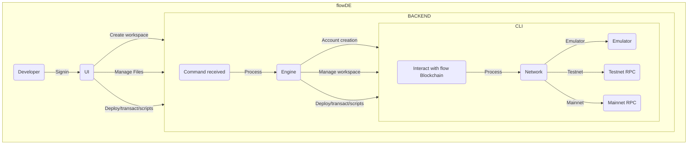

# Problem

Currently, all development on the flow blockchain requires developers to locally install the CLI, run the emulator, manage versions and manually deploy their contracts or run transactions and scripts. Projects which are currently available, although they do speed up development, still require local installation of the flow CLI.

# Solution - flowDE

flowDE is a fully deployed development environment that allows developers to quickly start building, deploying and testing all within a cloud based environment within the browser. This speeds up the development process and makes it easier for developers to develop on the flow blockchain without any overhead.

# How it works

## Frontend

We built an Angular frontend deployed to Vercel, which developers will use for their full development usecase, ie. write contracts/transactions/scripts and be able to deploy directly from their browser.

## Backend
The backend is a Flask API, written in Python and deployed to a VPS on DigitalOcean which interacts with the flow CLI from within the container. A workspace is created on command by the developer and command are then managed from the UI. An emulator instance is being run as a detached process to allow all workspaces to interact with it from within to prevent overuse of the server resources.

# Future development/Improvements

## Codebase
For our submission, we prioritized speed of execution to get the MVP out at the cost of clean code, refactoring of the codebase to ensure robustness will be done.

## Security
We will need to implement a KMS into the solution as a matter of importance to ensure that key (especially on mainnet) are secure.

## UI/UX
Improved UI and UX will be undertaken, to better the look, feel and usability of the application.

## Overall improvements
Better handling and additional commands to be introduced, allowing developers to use existing accounts and not having to create a new account to deploy on testnet and mainnet

**THANK YOU**